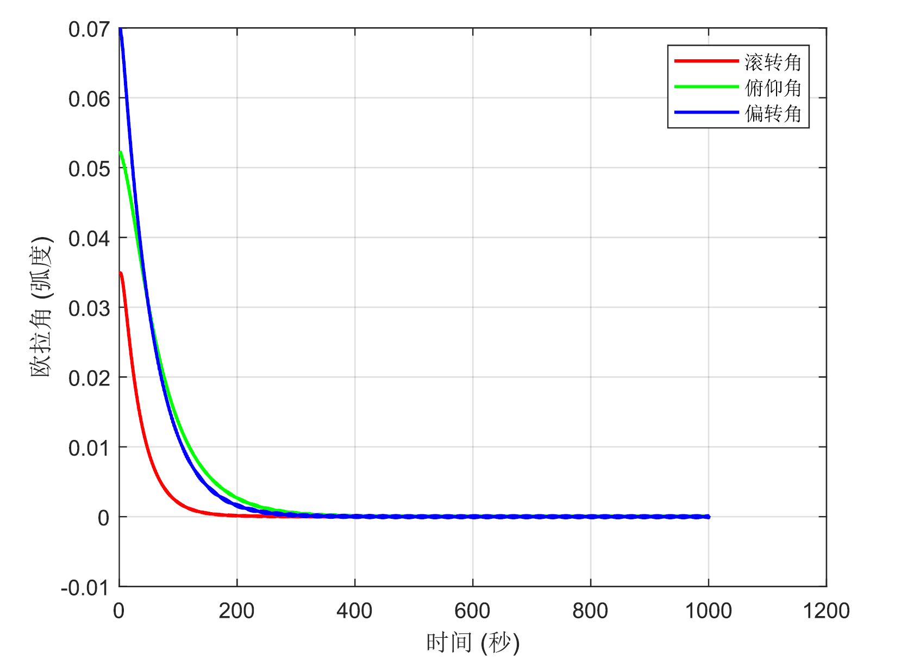
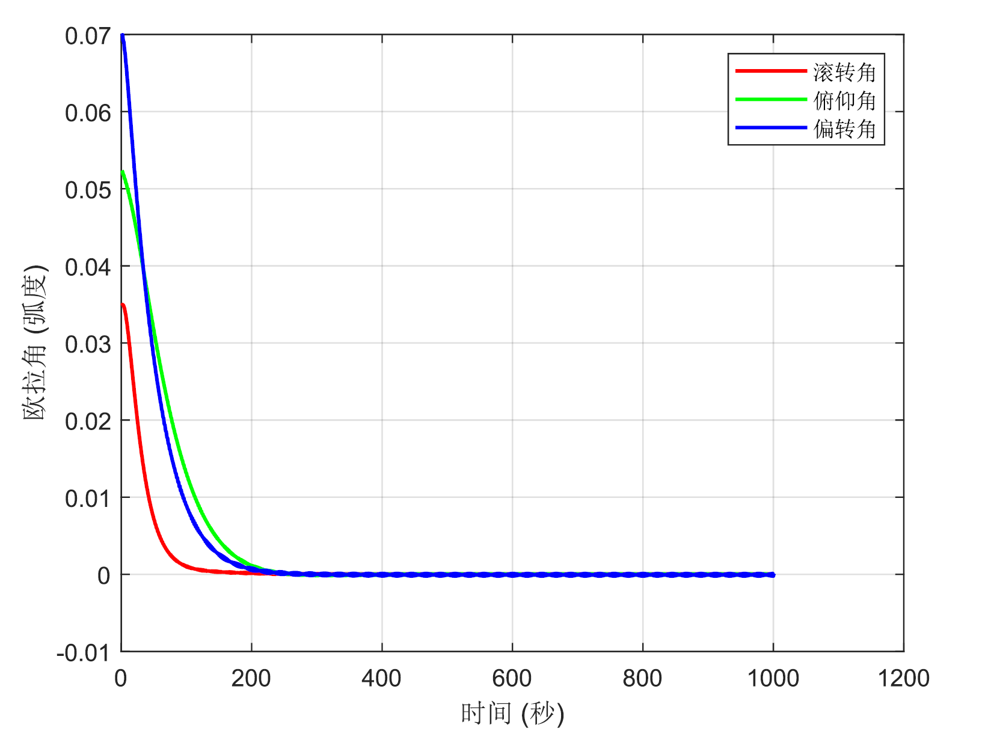
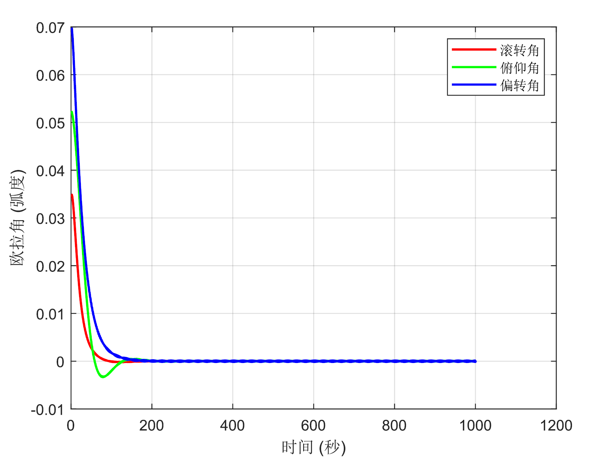

# 航天器姿态控制实验报告 README

本实验构建了航天器姿态控制的基本框架，对比了三种航天器姿态控制方法：基础PD控制、基于BP神经网络的PD控制以及基于遗传算法的PD控制。

### 1. 基础PD控制

- **描述**：基础PD控制器在干扰力矩作用下，欧拉角（滚转、俯仰、偏转）约在**300秒**后稳定至目标精度（±0.1°）。
- **参数**：
  - 比例增益（KP）和微分增益（KD）为固定值。
  - 干扰力矩：包含正弦和余弦分量，模拟复杂空间环境。

### 2. 基于BP神经网络的PD控制

- **描述**：通过BP神经网络动态调整PID参数，系统在**更短时间**内（对比基础PD）达到稳定，且超调量显著降低。
- **改进**：
  - 输入层节点数：3，隐含层节点数：4，输出层节点数：2。
  - 参数自学习机制提升了控制器的自适应能力。
  - 
### 3. 基于遗传算法的PD控制

- **描述**：遗传算法优化后的PID参数使系统在**200秒内**快速稳定，控制性能最优。
- **优化过程**：
  - 种群大小：6，迭代次数：100，适应度函数基于积分绝对误差（IAE）。
  - 优化后参数显著提升响应速度与稳定性。

## 结论
- **基础PD控制**：作为基准方法，稳定性达标但响应较慢。
- **BP神经网络控制**：通过参数自适应调整，缩短稳定时间并提高精度。
- **遗传算法控制**：全局优化参数，响应最快，鲁棒性最强。
